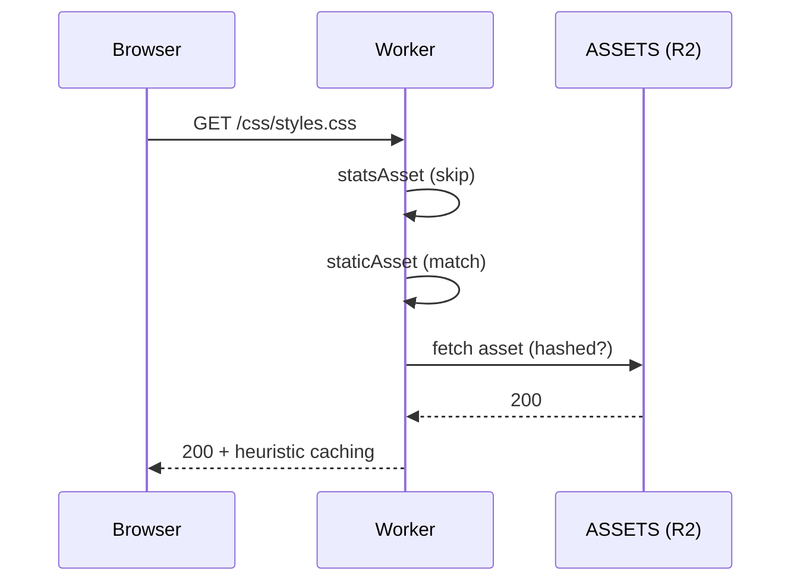
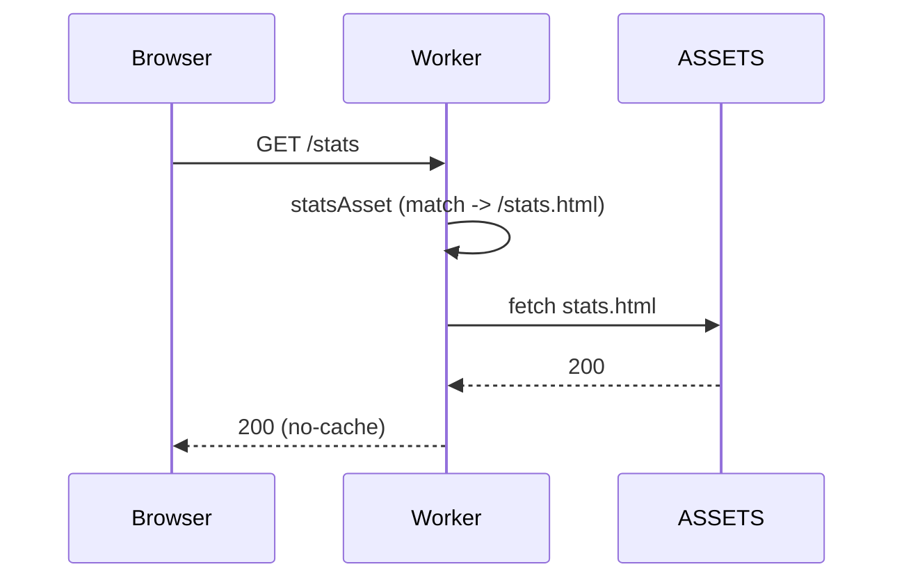
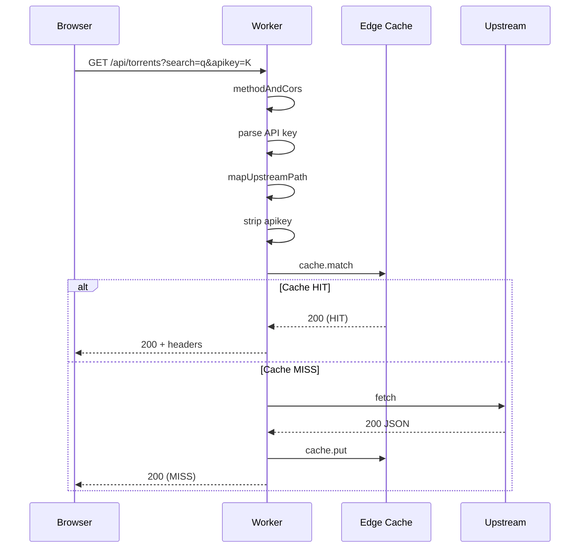
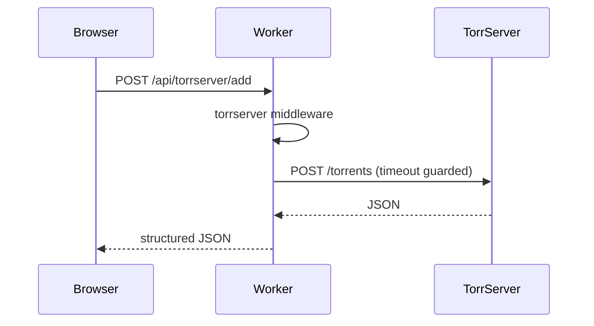

# Architecture

> Comprehensive documentation of the runtime model for **cf-jacred-fbd**. For a high‑level feature overview see `README.md`.

## Table of Contents

1. [Scope](#scope)
2. [High-Level Overview](#high-level-overview)
3. [Worker Middleware Pipeline](#worker-middleware-pipeline)
4. [Middleware Responsibility Matrix](#middleware-responsibility-matrix)
5. [Decision Tree](#decision-tree)
6. [Sequence Diagrams](#sequence-diagrams)
7. [Context Object Shape](#context-object-shape)
8. [Middleware Contracts](#middleware-contracts)
9. [Caching & Revalidation Notes](#caching--revalidation-notes)
10. [Security & Hardening Hooks](#security--hardening-hooks)
11. [Error Envelope](#error-envelope)
12. [Extension Points](#extension-points)

---

## Scope

This document covers runtime request flow, responsibilities of each middleware layer, caching model, and extension affordances. Build tooling, contribution workflow, and user‑facing feature descriptions intentionally remain in `README.md`.

## High-Level Overview

The system consists of:

- **Static UI (Search + Stats)**: Served from Cloudflare Pages asset store (ASSETS binding).
- **Edge Worker**: Custom `_worker.js` that acts as:
  - Reverse proxy to upstream API (`/api/...` mapped paths)
  - Mediator for TorrServer helper endpoints
  - Security & caching layer (headers, API key stripping, cache key normalization)
  - Runtime static asset hash resolver (manifest based)
- **Upstream API**: Plain HTTP origin (TLS termination at Cloudflare edge).
- **Optional TorrServer**: User‑specified host for magnet addition & status.
- **Edge Cache (caches.default)**: Lightweight per-POP caching for GET responses with 60s TTL (plus 300s `s-maxage`).

### Diagram (Mermaid)

```mermaid
flowchart LR
  Browser[(User Browser)] -->|HTTPS| Pages[Cloudflare Pages\n(Static Assets)]
  Pages --> Worker[_worker.js\nMiddleware Pipeline]
  subgraph Edge[Cloudflare Edge]
    Worker --> Cache[(caches.default)]
  end
  Worker -->|/api/... mapped| Upstream[(Upstream API)]
  Worker -->|/api/torrserver/*| TorrServer[(TorrServer Instance)]
  Worker -. optional service tokens .-> CFAccess[(Cloudflare Access)]
  Worker -->|/api/conf| Upstream
  Worker -->|Static /index /stats| Cache
```

<details><summary><strong>ASCII Fallback</strong></summary>

```text
+-----------+    HTTPS     +--------------------+          +---------------------+
| Browser   | -----------> | Cloudflare Pages   |  ----->  | Worker (_worker.js) |
| (User)    |              |  (Static Assets)   |          |  Middleware chain   |
+-----------+              +--------------------+          +----------+----------+
                                                              |  |  |  |  |  |
                                                              v  v  v  v  v  v
                                                          +---------------------+
                                                          |  caches.default     |
                                                          +---------------------+
                                                              |        |
                                                              v        v      v
                                                       +-----------+  +--------------+  +-----------------+
                                                       | Upstream  |  | TorrServer   |  | CF Access (opt) |
                                                       |  API      |  | (user URL)   |  |  svc tokens      |
                                                       +-----------+  +--------------+  +-----------------+
```

</details>

## Worker Middleware Pipeline

Order:

```text
statsAsset → staticAsset → methodAndCors → torrserver → confEndpoint → upstream
```

Rationale: Serve static & special assets first (fast path), reject invalid methods early, handle domain‑specific TorrServer logic, provide configuration discovery, then network proxy.

## Middleware Responsibility Matrix

| Order | Name            | Source             | When It Runs                                     | Returns Early For          | Side Effects                               |
| ----- | --------------- | ------------------ | ------------------------------------------------ | -------------------------- | ------------------------------------------ |
| 1     | `statsAsset`    | `statsAsset.ts`    | `pathname` in `/stats`, `/stats/`, `/stats.html` | Always (serves stats file) | Caching headers applied                    |
| 2     | `staticAsset`   | `staticAsset.ts`   | Non‑API & not a direct path                      | Always (serves file)       | Manifest lookup + caching headers          |
| 3     | `methodAndCors` | `methodAndCors.ts` | Any leftover                                     | 405 / 204 (OPTIONS)        | Adds CORS headers (via later header layer) |
| 4     | `torrserver`    | `torrserver.ts`    | Path prefix `/api/torrserver/`                   | Add/Test JSON responses    | Network calls to TorrServer                |
| 5     | `confEndpoint`  | `conf.ts`          | `/api/conf`                                      | Merged JSON config         | Pulls upstream conf (best‑effort)          |
| 6     | `upstream`      | `upstream.ts`      | Remaining API or direct paths                    | Various error envelopes    | Performs proxied fetch + edge caching      |

> Any middleware returning a `Response` halts further processing.

## Decision Tree

1. Stats asset? → Serve & stop.
2. Non‑API, non‑direct? → Serve static & stop.
3. Method allowed? If not → 405 / OPTIONS 204.
4. TorrServer path? → Handle & stop.
5. `/api/conf`? → Return config & stop.
6. Else → Proxy upstream (enforce key, caching, security headers).

## Sequence Diagrams

### Static Asset (`/css/styles.css`)



### Stats Page (`/stats`)



### Torrent Search (`/api/torrents?search=...`)



### TorrServer Add (`/api/torrserver/add`)



## Context Object Shape

```ts
interface RequestContext {
  request: Request;
  env: WorkerEnv;
  url: URL;
  pathname: string;
  start: number;
  config: ResolvedConfig;
  apiKey: ApiKeyInfo;
  isApi: boolean;
  direct: boolean;
  state: Record<string, unknown>;
  upstreamPath?: string;
  upstreamUrl?: URL;
}
```

`state` is a scratchpad allowing later middleware to communicate without increasing parameter lists.

## Middleware Contracts

| Middleware      | Inputs                          | Adds to Context               | Failure Modes                                      |
| --------------- | ------------------------------- | ----------------------------- | -------------------------------------------------- |
| `statsAsset`    | `pathname`, `env.ASSETS`        | —                             | 404 pass‑through (served as is)                    |
| `staticAsset`   | `pathname`, manifest            | —                             | 404 pass‑through                                   |
| `methodAndCors` | `request.method`                | —                             | 405 / 204                                          |
| `torrserver`    | JSON body, timeout, credentials | —                             | 400 validation, 504 timeout, 502 network           |
| `confEndpoint`  | upstream `/api/conf`            | —                             | 403 invalid key, partial success on upstream error |
| `upstream`      | mapped path, timeouts, cache    | `upstreamPath`, `upstreamUrl` | 400, 403, 502, 504                                 |

## Caching & Revalidation Notes

- `cachedFetch` normalizes cache key (drops `_`, `apikey`, `api_key`).
- ETag based conditional: manual 304 construction with `Vary` token normalization (`Accept`, `If-None-Match`).
- Successful upstream GET: `public, max-age=60, s-maxage=300` + stored in `caches.default`.
- Hashed static assets: `public, max-age=31536000, immutable`.
- HTML: `no-cache, must-revalidate`.

## Security & Hardening Hooks

| Concern           | Mechanism                                      |
| ----------------- | ---------------------------------------------- |
| API key leakage   | Stripped query param before upstream URL fetch |
| Clickjacking      | `X-Frame-Options: DENY`                        |
| MIME sniffing     | `X-Content-Type-Options: nosniff`              |
| Referrer privacy  | `Referrer-Policy: no-referrer`                 |
| XS-Leaks baseline | COOP + CORP headers                            |
| Permissions scope | Minimal `Permissions-Policy`                   |
| Cache poisoning   | Normalized key + header sanitization           |

Future: Content-Security-Policy, Subresource Integrity, Turnstile / rate limiting.

## Error Envelope

Canonical structure (fields may include additional diagnostics):

```json
{ "error": "Сообщение", "code": "upstream_timeout", "locale": "ru", "timeoutMs": 30000 }
```

HTTP status alignment:

| Status | Typical Causes                                    |
| ------ | ------------------------------------------------- |
| 400    | Path decode failure, mapping error, bad body      |
| 403    | Invalid / missing API key when enforcement active |
| 404    | Static asset missing (served as‑is)               |
| 405    | Disallowed method                                 |
| 502    | Upstream network error / TorrServer network error |
| 504    | Upstream / TorrServer timeout                     |

## Extension Points

| Area                 | Approach                                                                         |
| -------------------- | -------------------------------------------------------------------------------- |
| New virtual endpoint | Insert middleware before `upstream` in pipeline array                            |
| Additional headers   | Extend `addStandardResponseHeaders` or wrap `upstream`                           |
| Observability        | Add a logging middleware after `methodAndCors`                                   |
| Rate limiting        | Middleware before `torrserver` / `upstream` using durable objects or KV counters |
| CSP enforcement      | Add header in `addStandardResponseHeaders` (feature flag)                        |

---

### Last updated: 2025-09-23
