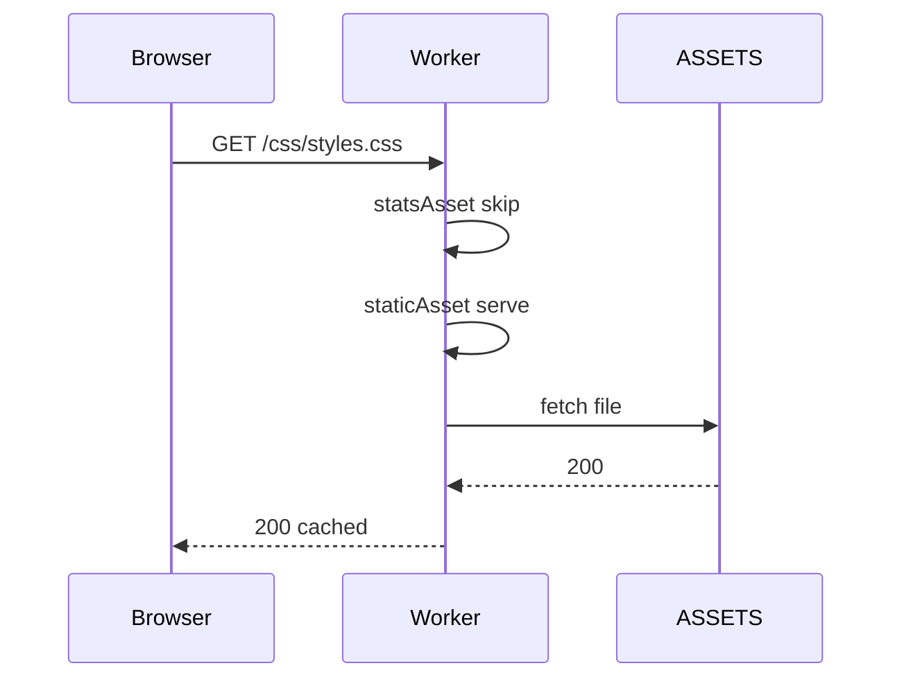
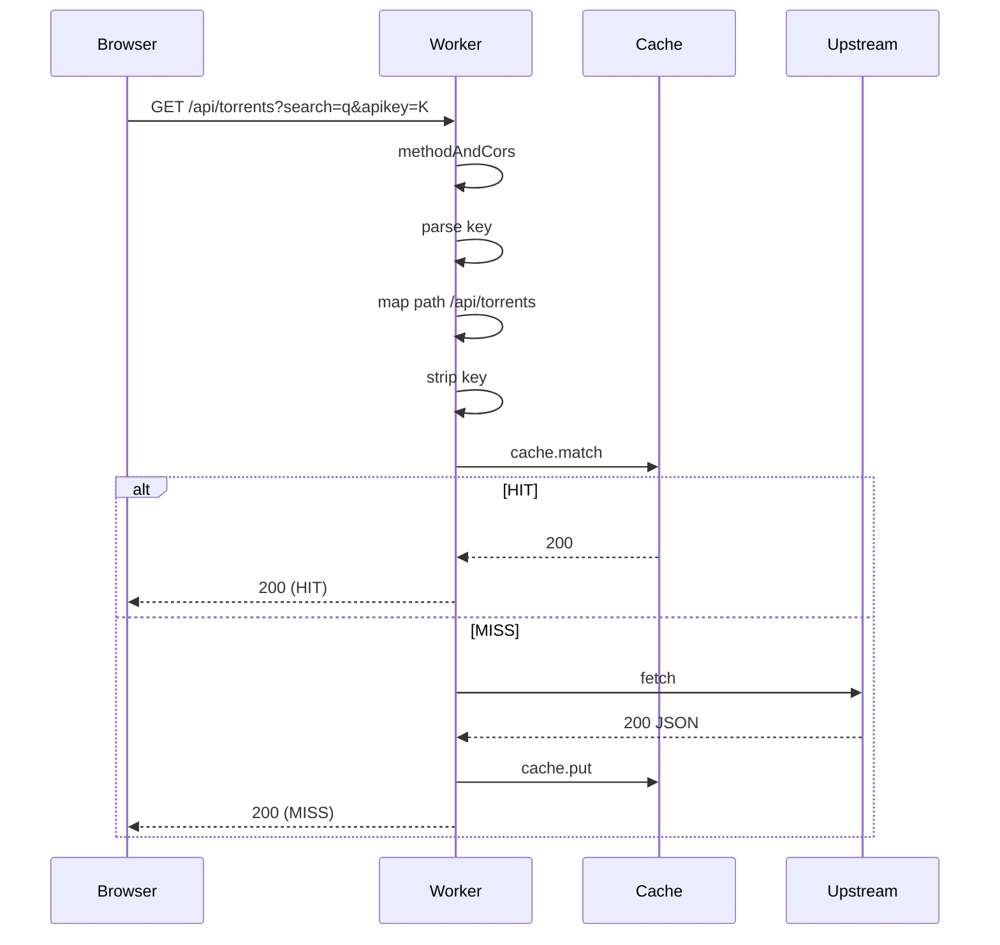

# Архитектура (Русская версия)

> Языки: 🇷🇺 Русский | [English](./ARCHITECTURE.md)

> Подробное описание рантайм модели **cf-jacred-fbd**. Для краткого обзора функций см. `README.ru.md`.

## Оглавление

1. [Область документа](#область-документа)
2. [Высокоуровневый обзор](#высокоуровневый-обзор)
3. [Конвейер middleware](#конвейер-middleware)
4. [Матрица ответственности](#матрица-ответственности)
5. [Дерево решений](#дерево-решений)
6. [Последовательности (диаграммы)](#последовательности-диаграммы)
7. [Структура контекста](#структура-контекста)
8. [Контракты middleware](#контракты-middleware)
9. [Кеширование и ревалидация](#кеширование-и-ревалидация)
10. [Безопасность](#безопасность)
11. [Формат ошибок](#формат-ошибок)
12. [Точки расширения](#точки-расширения)

---

## Область документа

Описывает поток запроса, обязанности каждого middleware, модель кеширования, точки расширения. Сборка и workflow — в README.

## Высокоуровневый обзор

Система включает:

- **Статический UI** (Поиск + Статистика) — ассеты Cloudflare Pages (ASSETS binding)
- **Edge Worker** — `_worker.js` выполняет: прокси к апстриму, помощники TorrServer, безопасность, кеширование, разрешение хешей
- **Upstream API** — простой HTTP сервер за Cloudflare
- **Опциональный TorrServer** — пользовательский экземпляр
- **Edge Cache** — `caches.default` для короткоживущих GET

### Диаграмма

```mermaid
flowchart LR
  Browser[(Browser)] -->|HTTPS| Pages[Cloudflare Pages\n(Static)]
  Pages --> Worker[_worker.js\nPipeline]
  subgraph Edge[Cloudflare Edge]
    Worker --> Cache[(caches.default)]
  end
  Worker -->|/api/...| Upstream[(Upstream API)]
  Worker -->|/api/torrserver/*| TorrServer[(TorrServer)]
  Worker -. svc tokens .-> CFAccess[(CF Access)]
```

## Конвейер middleware

```text
statsAsset → staticAsset → methodAndCors → torrserver → confEndpoint → upstream
```

Причина порядка: быстрый возврат статики, ранняя валидация метода, доменные операции, затем общий прокси.

## Матрица ответственности

| Порядок | Имя             | Источник           | Когда                | Ранний возврат | Побочные эффекты    |
| ------- | --------------- | ------------------ | -------------------- | -------------- | ------------------- |
| 1       | `statsAsset`    | `statsAsset.ts`    | Путь `/stats(.html)` | Всегда         | Заголовки кеша      |
| 2       | `staticAsset`   | `staticAsset.ts`   | Не API и не прямой   | Всегда         | Манифест, кеш       |
| 3       | `methodAndCors` | `methodAndCors.ts` | Остаток              | 405 / 204      | CORS заголовки      |
| 4       | `torrserver`    | `torrserver.ts`    | `/api/torrserver/`   | JSON           | Сетевые вызовы      |
| 5       | `confEndpoint`  | `conf.ts`          | `/api/conf`          | JSON           | Объединённый конфиг |
| 6       | `upstream`      | `upstream.ts`      | Остальные            | Ошибки/прокс   | Кеш + заголовки     |

## Дерево решений

1. Статистика? → отдать и остановиться
2. Не API/не прямой? → статический ассет
3. Метод валиден? иначе 405/204
4. TorrServer путь? обработать
5. `/api/conf`? вернуть JSON
6. Иначе проксировать (ключ, маппинг, кеш, заголовки)

## Последовательности (диаграммы)

### Статический ассет



### Поиск торрентов



## Структура контекста

```ts
interface RequestContext {
  request: Request;
  env: WorkerEnv;
  url: URL;
  pathname: string;
  start: number;
  config: ResolvedConfig;
  apiKey: ApiKeyInfo;
  isApi: boolean;
  direct: boolean;
  state: Record<string, unknown>;
  upstreamPath?: string;
  upstreamUrl?: URL;
}
```

## Контракты middleware

| Middleware      | Входы                    | Доб. поля                     | Ошибки          |
| --------------- | ------------------------ | ----------------------------- | --------------- |
| `statsAsset`    | `pathname`, `env.ASSETS` | —                             | 404 passthrough |
| `staticAsset`   | `pathname`, manifest     | —                             | 404 passthrough |
| `methodAndCors` | `request.method`         | —                             | 405/204         |
| `torrserver`    | JSON тело, таймаут       | —                             | 400/502/504     |
| `confEndpoint`  | апстрим `/api/conf`      | —                             | 403/частично    |
| `upstream`      | маппинг пути             | `upstreamPath`, `upstreamUrl` | 400/403/502/504 |

## Кеширование и ревалидация

- Нормализация ключа (удаляем `_`, `apikey`, `api_key`)
- ETag + условный 304
- GET: `public, max-age=60, s-maxage=300`
- Хеш ассеты: `31536000, immutable`
- HTML: `no-cache`

## Безопасность

| Аспект           | Механизм                          |
| ---------------- | --------------------------------- |
| Утечка API ключа | Удаление из query перед fetch     |
| Clickjacking     | `X-Frame-Options: DENY`           |
| MIME sniff       | `X-Content-Type-Options: nosniff` |
| Referrer         | `no-referrer`                     |
| XS-Leaks         | COOP + CORP                       |
| Permissions      | Минимальный Permissions-Policy    |
| Cache poisoning  | Нормализованный ключ              |

Будущее: CSP, SRI, rate limiting, Turnstile.

## Формат ошибок

```json
{ "error": "Сообщение", "code": "upstream_timeout", "locale": "ru", "timeoutMs": 30000 }
```

## Точки расширения

| Зона                       | Подход                                          |
| -------------------------- | ----------------------------------------------- |
| Новый виртуальный эндпоинт | Middleware перед `upstream`                     |
| Доп. заголовки             | Расширить addStandardResponseHeaders            |
| Логирование                | Middleware после `methodAndCors`                |
| Rate limiting              | Вставить до сетевых вызовов (Durable Object/KV) |
| CSP                        | Добавить в общую функцию заголовков             |

---

Последнее обновление: 2025-09-23

---

🔁 Переключить язык: [English architecture](./ARCHITECTURE.md)
